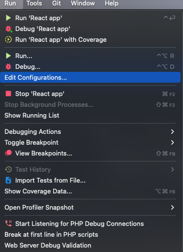
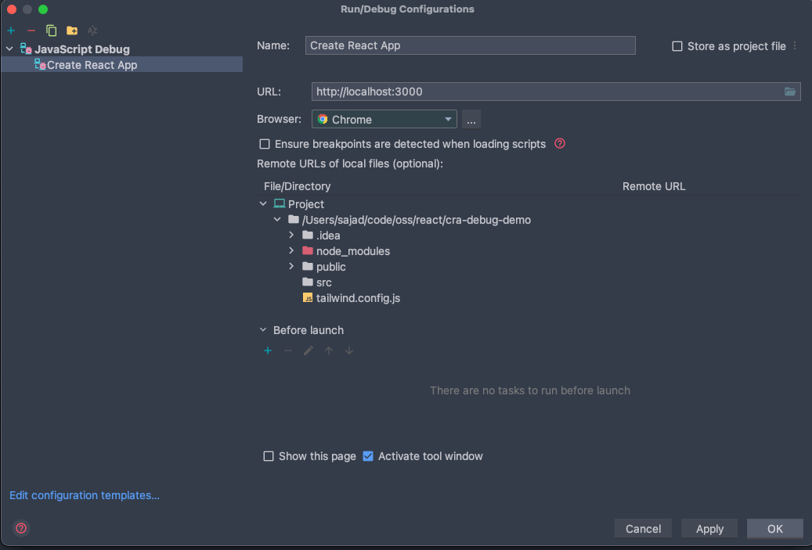
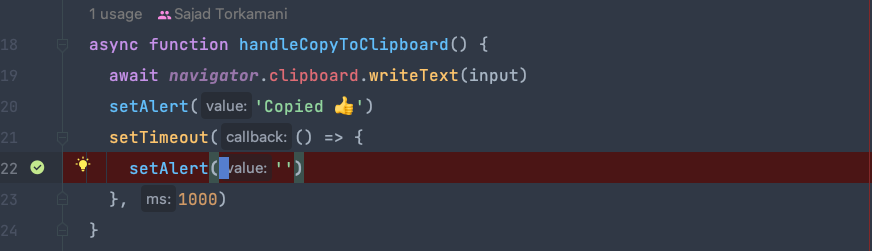
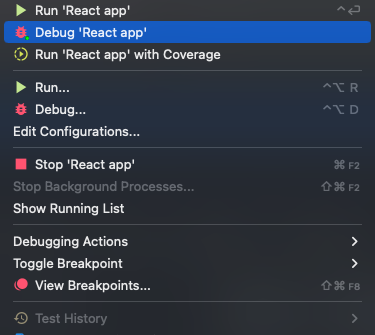
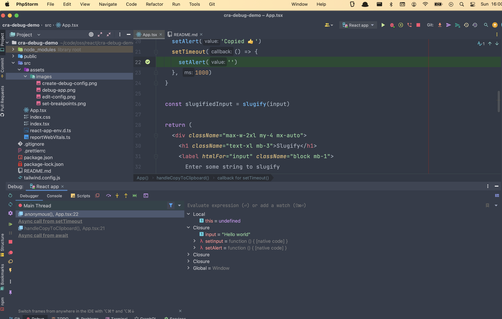

## Quick start

### Install dependencies and start app:

```shell
npm i && npm run start
```

### Create a debug configuration





### Set breakpoints



### Debug app



### Activate the breakpoints

Take the actions on the page that should trigger your breakpoints (e.g., clicking a button).

### Use the debugger

Your breakpoints should be activated and the IDE should be brought into focus.

